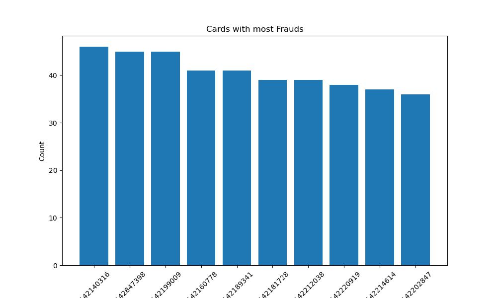
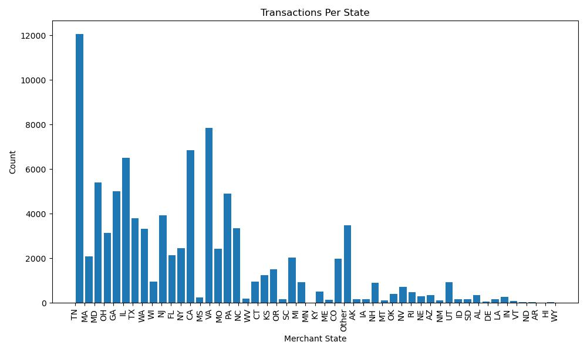
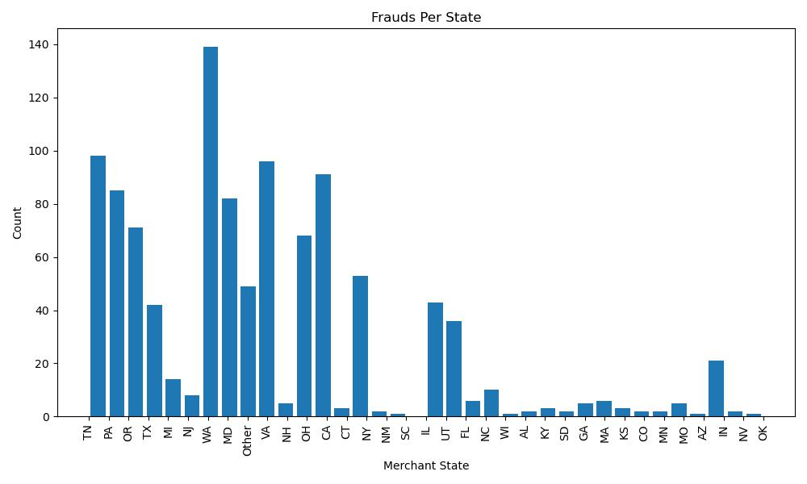
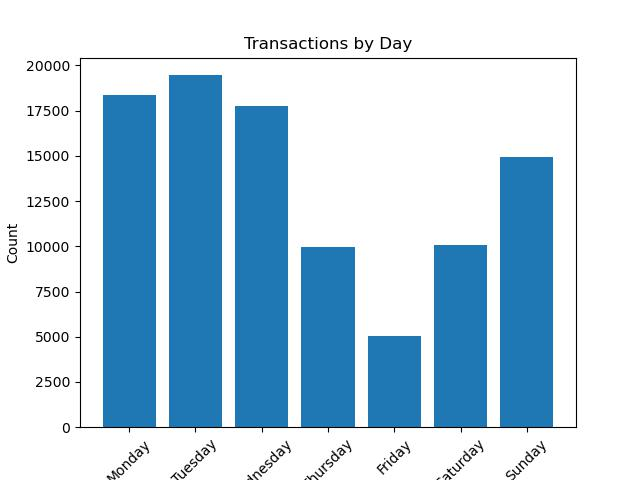
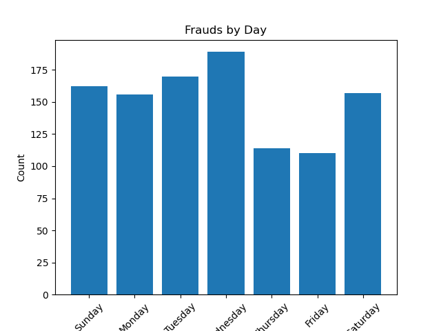
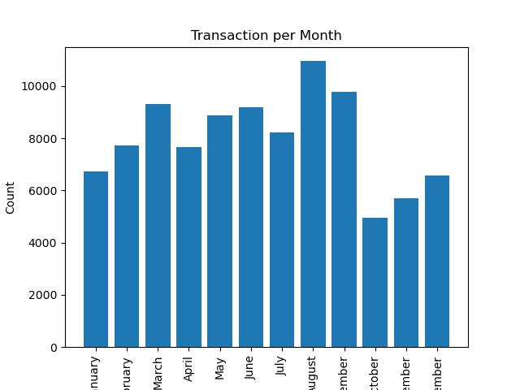
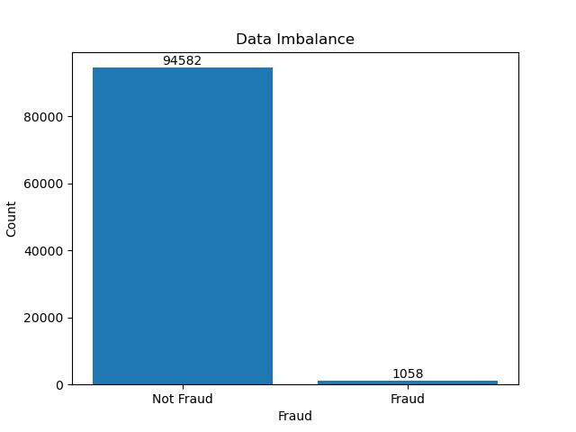

# Credit_Card_Transaction_Fraud_Prediction
This repository is a part of my graduate studies at the University of Southern California. I completed this project as a part of the Fraud Analytics class. 
The data is consisting of credit card transactions. Every row describes a transaction. There are 10 attributes and 96,753 rows. From the year 2010.
Cardnum is the abbreviation for card number. There are 1645 unique numbers for this field. This signifies that the data consists of transactions using 1645 different cards. Each unique number represents a credit card.These are the cards with most frauds.

## Lets take a look at how the frad activity looks across different states.

## How does day of the week affect fraudulent activity?

## How does month affect fraudulent activity?

## Total Frauds and Genunine transactions

We can see that there is a big imbalance in data. 

## What are we actually doing?
The task at hand involves predicting fraudulent transactions specifically during the months of November and December, which constitute out-of-time data. Transactions during these months exhibit distinct patterns, and since the training data does not encompass this period, the challenge is heightened.Accuracy will not make a huge difference because the data is imbalanced and even if we predict that all cases are geniune we will get an accuracy score over 90%. Hence we will chceck the f1 score.

We follow these steps to complete our task:
1) Data Cleaning
2) Feature engineering
3) Machine learning
4) Deep learning

In machine learning we tried and evaluated the models below
1) Logistic regression
2) Random forest
3) SVM 
4) XG Boost

In deep learning we tried and evaluated the models below
1) CNN
2) RNN
3) LSTM

## Conclusion

After testing different ML and DL algorithms these are our results.
The best machine learning model is XGBoost with a F1 score of 0.85 if we do not process the transactions that are correctly identified by the model we will save an amount of $140065.52.
The best deep learning model is RNN with an F1 score of 0.93 if we do not process the transactions that are correctly identified by the model we will save an amount of $120446.33.
 

